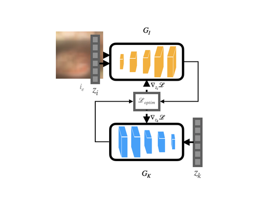

# DeDOS
Deconvolving Deep Optical Encoders with Learned Samples (DeDOS)

| Poster Video                                                                                                | Poster PDF                                                                                                |
|------------------------------------------------------------------------------------------------------------|--------------------------------------------------------------------------------------------------------------------|
|  |  |

Requirements: Python 3.7.11 <